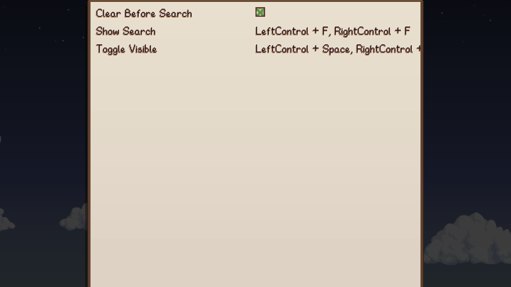
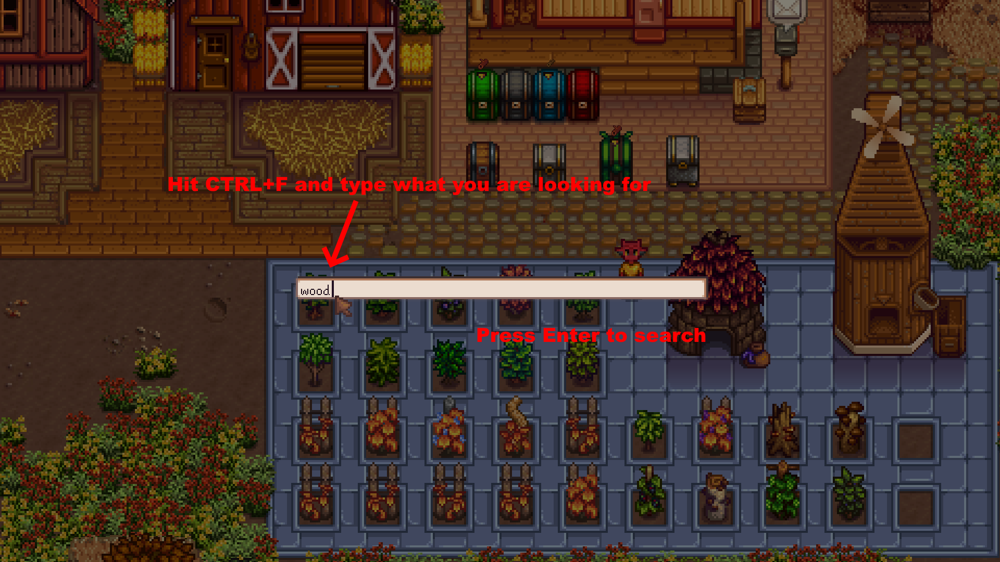
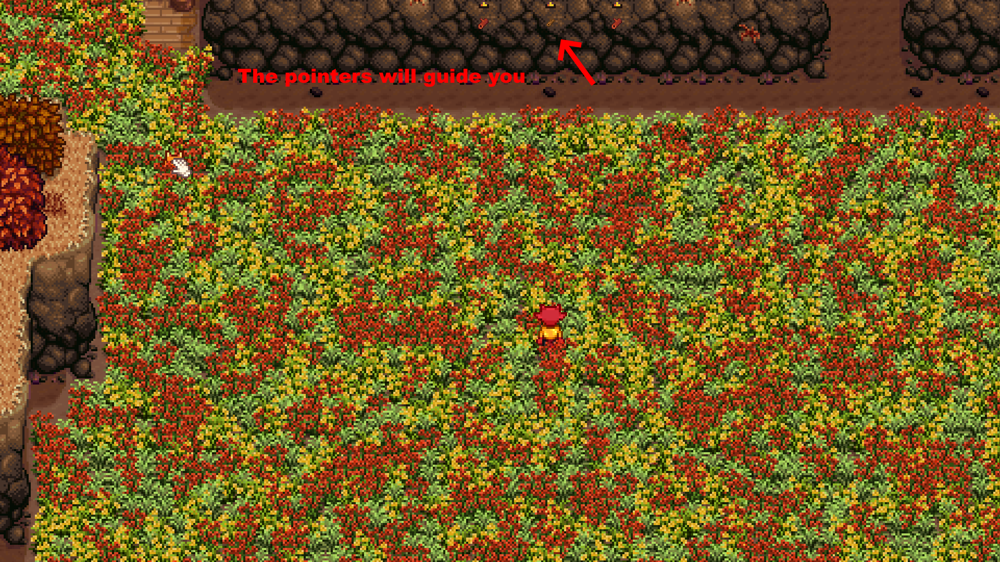
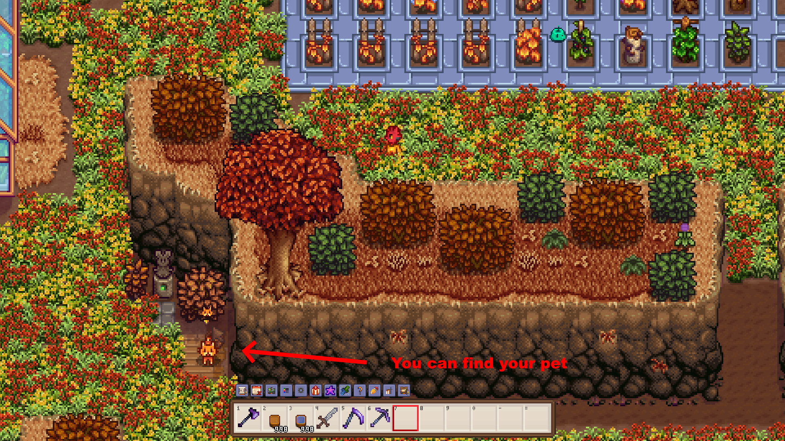
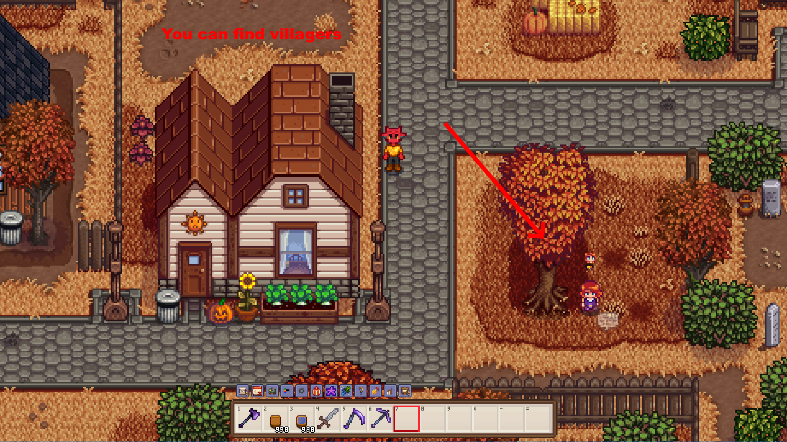
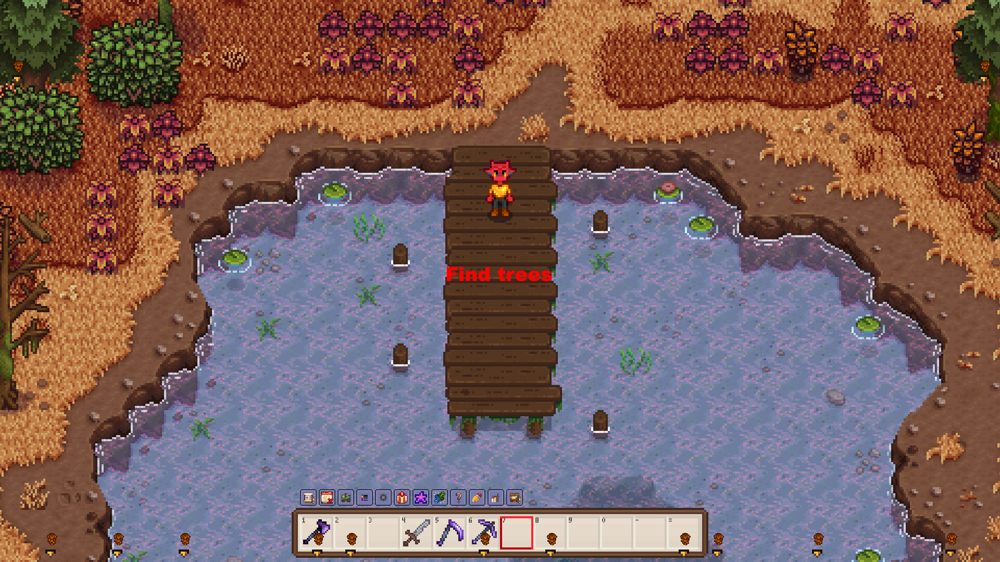

# Find Anything

Stardew Valley mod which lets you search for anything in your current location.

## Table of Contents

- [Find Anything](#find-anything)
  - [Table of Contents](#table-of-contents)
  - [Configurations](#configurations)
  - [Features](#features)
  - [Translations](#translations)

## Configurations

For ease of use, it is recommended to set config options
from [Generic Mod Config Menu](https://www.nexusmods.com/stardewvalley/mods/5098).

## Features

Search for anything in your current location.

Pointers guide you to your search.

Search for your pet.

Find your friends.

Find trees.

There are many more things you can search for.

## Translations

❌️ = Not Translated, ❔ = Incomplete, ✔️ = Complete

|            |         Find Anything          |
| :--------- | :---------------------------: |
| Chinese    | [❌️](FindAnything/i18n/zh.json) |
| French     | [❌️](FindAnything/i18n/fr.json) |
| German     | [❌️](FindAnything/i18n/de.json) |
| Hungarian  | [❌️](FindAnything/i18n/hu.json) |
| Italian    | [❌️](FindAnything/i18n/it.json) |
| Japanese   | [❌️](FindAnything/i18n/ja.json) |
| Korean     | [❌️](FindAnything/i18n/ko.json) |
| Portuguese | [❌️](FindAnything/i18n/pt.json) |
| Russian    | [❌️](FindAnything/i18n/ru.json) |
| Spanish    | [❌️](FindAnything/i18n/es.json) |
| Turkish    | [❌️](FindAnything/i18n/tr.json) |